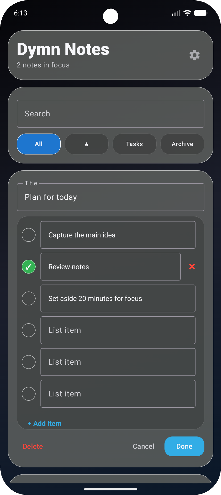

# Dymn Notes

### Modern Material Design Note-Taking App for Android

Clean, fast and modern note-taking application built with Kotlin and Material Design 3.

---

# 🎬 Preview

---

# ✨ Features

- 📝 Create and edit notes
- ✅ Interactive checklist notes
- ⭐ Favorite notes
- 📦 Archive notes
- 🔍 Instant search
- 🎨 Custom wallpapers
- 🎨 Custom tile colors
- 🌙 Dark theme
- ⚡ Fast and lightweight
- 📱 Material Design 3

---

# 📸 Screenshots

---

# 📥 Download

Download the latest APK from the **Releases** section.

---

# 📄 License

This project is licensed under the MIT License.

---

### Created with ❤️ by Dymn Studio

