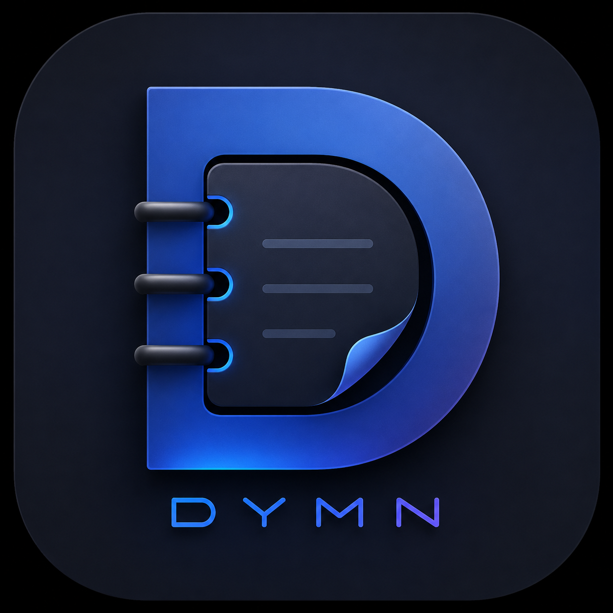
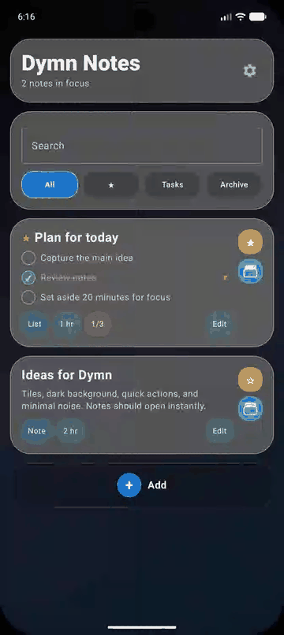
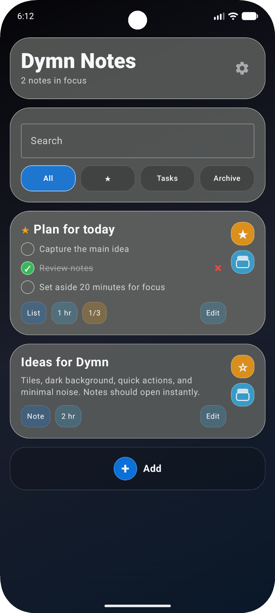
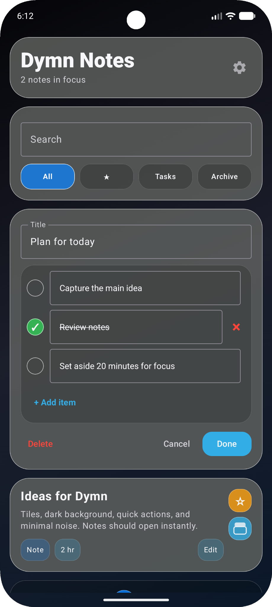
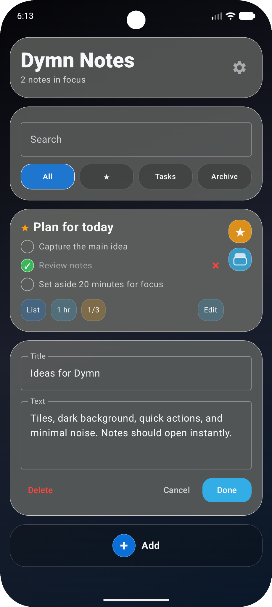
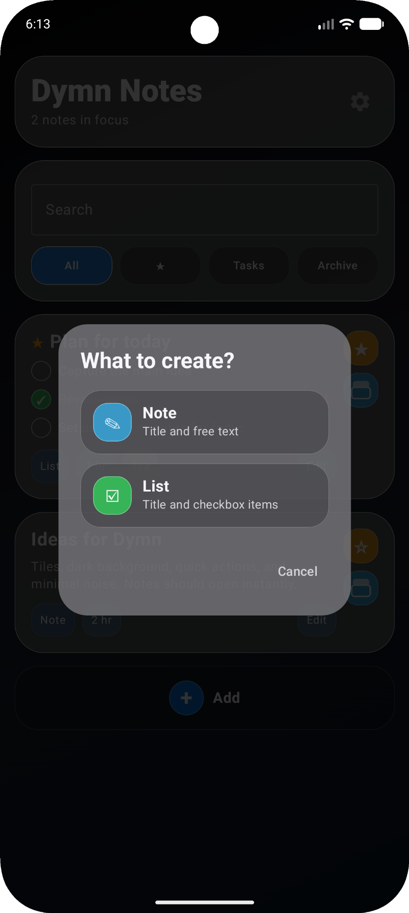
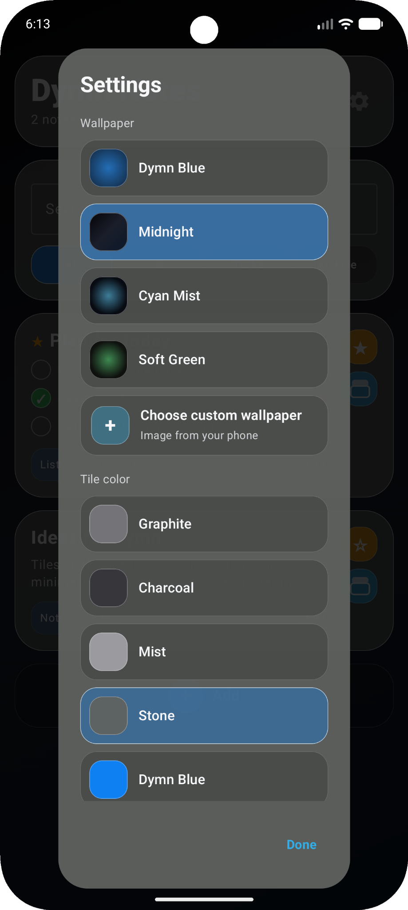
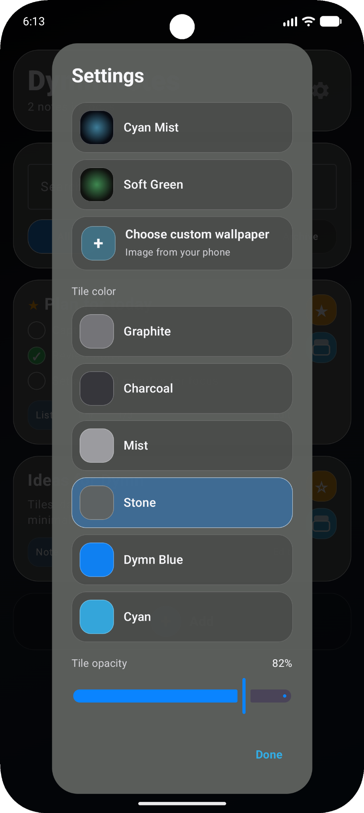

<div align="center">



# Dymn Notes

### Modern Material Design note-taking app for Android


</div>

---

## Overview

**Dymn Notes** is a clean, fast and customizable note-taking app for Android.  
It is designed around a dark visual style, rounded tiles, quick actions and a simple workflow for everyday notes and task lists.

---

## Preview

<div align="center">



</div>

---

## Features

- Create simple text notes
- Create checklist notes with interactive items
- Mark tasks as completed
- Favorite important notes
- Archive notes
- Search notes instantly
- Edit notes directly from the main screen
- Customize wallpaper style
- Customize tile color
- Adjust tile opacity
- Dark, minimal and modern interface
- Built with Kotlin for Android

---

## Screenshots

<div align="center">





<br><br>





</div>

---

## Built With

- Kotlin
- Android Studio
- Material Design style UI
- Gradle Kotlin DSL

---

## Project Structure

```text
Dymn-Notes/
├── app/
├── assets/
│   ├── gifs/
│   ├── logo/
│   └── screenshots/
├── gradle/
├── build.gradle.kts
├── settings.gradle.kts
└── README.md
